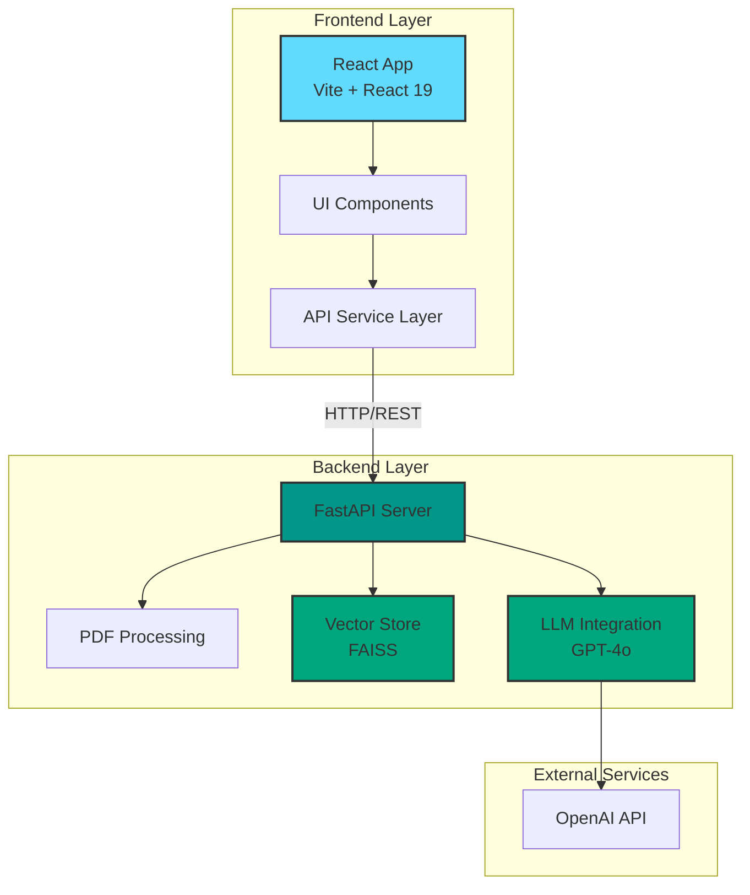

# Intelligent Document Assistant

<div align="center">

It is an enterprise-grade intelligent document assistant designed to analyze Documents using advanced Generative AI and Retrieval-Augmented Generation (RAG) technology.

[](https://fastapi.tiangolo.com/)
[](https://react.dev/)
[](https://www.langchain.com/)
[](https://www.python.org/)

</div>

---

## 📋 Table of Contents

- [Overview](#-overview)
- [Key Features](#-key-features)
- [Architecture](#-architecture)
- [Technology Stack](#-technology-stack)
- [Prerequisites](#-prerequisites)
- [Quick Start](#-quick-start)
- [Manual Setup](#-manual-setup)
- [Project Structure](#-project-structure)
- [API Documentation](#-api-documentation)
- [Configuration](#-configuration)
- [Development Guide](#-development-guide)
- [Deployment](#-deployment)
- [Security & Privacy](#-security--privacy)
- [Troubleshooting](#-troubleshooting)
- [Contributing](#-contributing)
- [License](#-license)

---

## 🎯 Overview

Accord Enterprise is a modern, decoupled web application that empowers users to interact with complex document sets through natural language. Built with a **React** frontend and **FastAPI** backend, it leverages state-of-the-art AI technologies to provide accurate, context-aware responses to user queries.

### Use Cases

- **Healthcare**: Analyze patient reports and medical documents
- **Legal**: Review Legal Contracts and Agreements
- **Research**: Extract insights from academic papers
- **Education**: Query student documentation
- **Business**: Query corporate documentation and contracts

---

## ✨ Key Features

### 🚀 Core Capabilities

- **📄 Multi-Document Upload**: Drag-and-drop interface supporting batch PDF uploads
- **🤖 AI-Powered Chat**: Context-aware conversational interface using GPT-4o
- **🔍 RAG Pipeline**: Retrieval-Augmented Generation for accurate, source-grounded responses
- **⚡ Real-time Processing**: Instant document indexing and query responses
- **🔒 Privacy-First**: In-memory processing with automatic session cleanup
- **🎨 Premium UI**: Modern design with glassmorphism, animations, and responsive layouts
- **📊 Vector Search**: FAISS-powered semantic search for relevant document retrieval
- **🔄 Session Management**: Stateful document context throughout user sessions

### 🎨 User Experience

- **Responsive Design**: Optimized for desktop, tablet, and mobile devices
- **Smooth Animations**: Framer Motion-powered transitions
- **Intuitive Interface**: Clean, modern UI with clear visual hierarchy
- **Real-time Feedback**: Loading states and progress indicators
- **Error Handling**: Graceful error messages and recovery

---

## 🏗️ Architecture

Intelligent Document Assistant follows a modern **microservices architecture** with clear separation of concerns:



### Data Flow

1. **Document Upload**
   - User uploads PDF(s) via React frontend
   - Files sent to `/upload` endpoint
   - Backend extracts text using PyPDF
   - Text chunked using RecursiveCharacterTextSplitter
   - Chunks embedded and indexed in FAISS vector store

2. **Chat Query**
   - User sends question via chat interface
   - Query sent to `/chat` endpoint
   - Backend performs semantic search in FAISS
   - Relevant chunks retrieved and formatted as context
   - GPT-4o generates response based on context
   - Response streamed back to frontend

---

## 🛠️ Technology Stack

### Frontend

| Technology | Version | Purpose |
|------------|---------|---------|
| **React** | 19.2 | Component-based UI framework |
| **Vite** | 7.2.4 | Next-generation build tool and dev server |
| **Vanilla CSS** | - | Custom design system with CSS variables |
| **Framer Motion** | 12.24.12 | Animation library for smooth transitions |
| **Lucide React** | 0.562.0 | Modern, customizable icon library |
| **Axios** | 1.13.2 | HTTP client for API communication |
| **React Dropzone** | 14.3.8 | Drag-and-drop file upload component |

### Backend

| Technology | Version | Purpose |
|------------|---------|---------|
| **FastAPI** | 0.100+ | High-performance async web framework |
| **Uvicorn** | 0.20+ | ASGI server for FastAPI |
| **LangChain** | Latest | LLM application framework |
| **LangChain OpenAI** | 0.0.5+ | OpenAI integration for LangChain |
| **FAISS** | 1.7.4+ | Vector similarity search library |
| **PyPDF** | 3.0+ | PDF text extraction |
| **Python Dotenv** | 1.0+ | Environment variable management |

### AI/ML Components

- **OpenAI GPT-4o**: Advanced language model for chat responses
- **text-embedding-3-large**: High-quality embeddings for semantic search
- **RecursiveCharacterTextSplitter**: Intelligent text chunking (1000 chars, 200 overlap)
- **FAISS Vector Store**: Efficient similarity search with k=4 retrieval

---

## 📋 Prerequisites

Ensure you have the following installed on your system:

- **Node.js**: v16.0 or higher ([Download](https://nodejs.org/))
- **Python**: v3.9 or higher ([Download](https://www.python.org/))
- **npm**: Comes with Node.js
- **OpenAI API Key**: Required for AI functionality ([Get API Key](https://platform.openai.com/api-keys))

### System Requirements

- **RAM**: Minimum 4GB (8GB+ recommended for large documents)
- **Storage**: 500MB free space
- **OS**: macOS, Linux, or Windows with WSL2

---

## ⚡ Quick Start

The fastest way to get Accord Enterprise running:

### 1. Clone the Repository

```bash
git clone <repository-url>
cd AccordEnterprise-Demo-V1
```

### 2. Configure Environment

```bash
cp .env.example .env
```

Edit `.env` and add your OpenAI API key:

```env
OPENAI_API_KEY=sk-your-actual-api-key-here
ALLOWED_ORIGINS=http://localhost:5173,http://127.0.0.1:5173
```

### 3. Run the Application

```bash
chmod +x run_app.sh
./run_app.sh
```

The script will:
- ✅ Start the FastAPI backend on `http://localhost:8000`
- ✅ Start the Vite dev server on `http://localhost:5173`
- ✅ Open your browser automatically

**Access the application**: [http://localhost:5173](http://localhost:5173)

---

## 🔧 Manual Setup

For more control over the setup process:

### Backend Setup

```bash
# Navigate to backend directory
cd backend

# Create virtual environment
python3 -m venv .venv

# Activate virtual environment
# On macOS/Linux:
source .venv/bin/activate
# On Windows:
# .venv\Scripts\activate

# Install dependencies
pip install -r requirements.txt

# Run the server
uvicorn main:app --reload --host 0.0.0.0 --port 8000
```

**Backend will be available at**: `http://localhost:8000`

**API Documentation**: `http://localhost:8000/docs` (Swagger UI)

### Frontend Setup

```bash
# Navigate to frontend directory
cd frontend

# Install dependencies
npm install

# Start development server
npm run dev
```

**Frontend will be available at**: `http://localhost:5173`

### Production Build

```bash
# Build frontend for production
cd frontend
npm run build

# Preview production build
npm run preview
```

---

## 📁 Project Structure

```
AccordEnterprise/
│
├── backend/                          # FastAPI Backend
│   ├── app/                          # Application modules
│   │   ├── __init__.py               # Package initializer
│   │   ├── config.py                 # Configuration management
│   │   ├── pdf_utils.py              # PDF text extraction utilities
│   │   ├── vectorstore_utils.py      # FAISS vector store operations
│   │   └── chat_utils.py             # LLM chat model integration
│   ├── main.py                       # FastAPI application entry point
│   ├── requirements.txt              # Python dependencies
│   └── .env                          # Environment variables (not in git)
│
├── frontend/                         # React Frontend
│   ├── public/                       # Static assets
│   │   └── logo.png                  # Application logo
│   ├── src/                          # Source code
│   │   ├── components/               # React components
│   │   │   ├── ChatInterface.jsx     # Chat UI component
│   │   │   └── UploadArea.jsx        # File upload component
│   │   ├── App.jsx                   # Main application component
│   │   ├── main.jsx                  # React entry point
│   │   ├── index.css                 # Global styles & design system
│   │   └── api.js                    # API service layer
│   ├── index.html                    # HTML template
│   ├── package.json                  # Node dependencies
│   ├── vite.config.js                # Vite configuration
│   └── eslint.config.js              # ESLint configuration
│
├── .venv/                            # Python virtual environment (not in git)
├── .env.example                      # Environment variables template
├── run_app.sh                        # Unified startup script
└── README.md                         # This file
```

### Key Files Explained

#### Backend

- **`main.py`**: FastAPI application with CORS, endpoints, and lifecycle management
- **`config.py`**: Environment variable handling and configuration
- **`pdf_utils.py`**: PDF text extraction using PyPDF
- **`vectorstore_utils.py`**: FAISS index creation and similarity search
- **`chat_utils.py`**: OpenAI GPT-4o integration and prompt handling

#### Frontend

- **`App.jsx`**: Main layout with header, upload area, and chat interface
- **`ChatInterface.jsx`**: Chat UI with message history and input
- **`UploadArea.jsx`**: Drag-and-drop file upload with progress feedback
- **`api.js`**: Axios-based API client for backend communication
- **`index.css`**: Design system with CSS variables, animations, and utilities

---

## 📡 API Documentation

### Base URL

```
http://localhost:8000
```

### Endpoints

#### 1. Health Check

```http
GET /
```

**Response:**
```json
{
  "message": "AccordEnterprise API is running"
}
```

---

#### 2. Upload Documents

```http
POST /upload
```

**Content-Type:** `multipart/form-data`

**Request Body:**
- `files`: Array of PDF files

**Example (cURL):**
```bash
curl -X POST http://localhost:8000/upload \
  -F "files=@document1.pdf" \
  -F "files=@document2.pdf"
```

**Success Response (200):**
```json
{
  "status": "success",
  "message": "Processed 2 documents",
  "chunks": 45
}
```

**Warning Response (200):**
```json
{
  "status": "warning",
  "message": "No text extracted from documents"
}
```

**Error Response (500):**
```json
{
  "detail": "Error message describing the issue"
}
```

---

#### 3. Chat Query

```http
POST /chat
```

**Content-Type:** `application/json`

**Request Body:**
```json
{
  "message": "What are the key provisions in the CBA?"
}
```

**Example (cURL):**
```bash
curl -X POST http://localhost:8000/chat \
  -H "Content-Type: application/json" \
  -d '{"message": "What are the key provisions?"}'
```

**Success Response (200):**
```json
{
  "response": "Based on the documents, the key provisions include..."
}
```

**Error Response (400):**
```json
{
  "detail": "Please upload documents first"
}
```

**Error Response (500):**
```json
{
  "detail": "Failed to initialize chat model: Invalid API key"
}
```

---

### Interactive API Documentation

FastAPI provides automatic interactive API documentation:

- **Swagger UI**: [http://localhost:8000/docs](http://localhost:8000/docs)
- **ReDoc**: [http://localhost:8000/redoc](http://localhost:8000/redoc)

---

## ⚙️ Configuration

### Environment Variables

Create a `.env` file in the root directory:

```env
# Required: OpenAI API Key
OPENAI_API_KEY=sk-your-actual-api-key-here

# Optional: CORS Origins (comma-separated)
ALLOWED_ORIGINS=http://localhost:5173,http://127.0.0.1:5173
```

### Configuration Options

#### Backend (`backend/app/config.py`)

- **`OPENAI_API_KEY`**: Your OpenAI API key (required)
- **`ALLOWED_ORIGINS`**: Comma-separated list of allowed CORS origins

#### LLM Settings (`backend/app/chat_utils.py`)

```python
MODEL = "gpt-4o"              # OpenAI model
TEMPERATURE = 0.7             # Response creativity (0.0-1.0)
```

#### Embedding Model (`backend/app/vectorstore_utils.py`)

```python
model="text-embedding-3-large"  # OpenAI embedding model
```

#### Text Chunking (`backend/main.py`)

```python
chunk_size=1000               # Characters per chunk
chunk_overlap=200             # Overlap between chunks
```

#### Vector Search (`backend/app/vectorstore_utils.py`)

```python
k=4                           # Number of documents to retrieve
```

### Frontend Configuration

#### API Base URL (`frontend/src/api.js`)

```javascript
const API_BASE_URL = 'http://localhost:8000';
```

#### Vite Dev Server (`frontend/vite.config.js`)

```javascript
server: {
  port: 5173,
  host: true
}
```

---

## 👨‍💻 Development Guide

### Code Style

#### Backend (Python)

- Follow **PEP 8** style guide
- Use **type hints** for function signatures
- Document functions with **docstrings**
- Use **logging** instead of print statements

Example:
```python
def extract_text_from_pdf(file: Union[str, BinaryIO]) -> str:
    """
    Extracts text from a PDF file.
    
    Args:
        file: A file path (str) or a file-like object (BinaryIO).
        
    Returns:
        Extracted text as a string.
    """
    # Implementation
```

#### Frontend (JavaScript/React)

- Use **functional components** with hooks
- Follow **React best practices**
- Use **CSS variables** for theming
- Keep components **small and focused**

Example:
```jsx
function ChatMessage({ message, isUser }) {
  return (
    <div className={`message ${isUser ? 'user' : 'assistant'}`}>
      {message}
    </div>
  );
}
```

### Adding New Features

#### 1. Backend Endpoint

```python
# backend/main.py
@app.post("/new-endpoint")
async def new_endpoint(request: RequestModel):
    """Endpoint description."""
    try:
        # Implementation
        return {"status": "success"}
    except Exception as e:
        raise HTTPException(status_code=500, detail=str(e))
```

#### 2. Frontend API Call

```javascript
// frontend/src/api.js
export const newApiCall = async (data) => {
  const response = await axios.post(`${API_BASE_URL}/new-endpoint`, data);
  return response.data;
};
```

#### 3. React Component

```jsx
// frontend/src/components/NewComponent.jsx
import { useState } from 'react';
import { newApiCall } from '../api';

function NewComponent() {
  const [data, setData] = useState(null);
  
  const handleAction = async () => {
    const result = await newApiCall({ param: 'value' });
    setData(result);
  };
  
  return <div>{/* Component UI */}</div>;
}

export default NewComponent;
```

### Testing

#### Backend Tests

```bash
cd backend
pytest tests/
```

#### Frontend Tests

```bash
cd frontend
npm run test
```

### Linting

#### Backend

```bash
cd backend
flake8 app/ main.py
black app/ main.py
```

#### Frontend

```bash
cd frontend
npm run lint
```

---

## 🚀 Deployment

### Docker Deployment (Recommended)

Create `Dockerfile` for backend:

```dockerfile
FROM python:3.11-slim

WORKDIR /app

COPY backend/requirements.txt .
RUN pip install --no-cache-dir -r requirements.txt

COPY backend/ .

CMD ["uvicorn", "main:app", "--host", "0.0.0.0", "--port", "8000"]
```

Create `docker-compose.yml`:

```yaml
version: '3.8'

services:
  backend:
    build: .
    ports:
      - "8000:8000"
    env_file:
      - .env
    
  frontend:
    image: node:18
    working_dir: /app
    volumes:
      - ./frontend:/app
    ports:
      - "5173:5173"
    command: npm run dev -- --host
```

Run with Docker:

```bash
docker-compose up -d
```

### Production Deployment

#### Backend (Gunicorn + Uvicorn)

```bash
pip install gunicorn
gunicorn main:app -w 4 -k uvicorn.workers.UvicornWorker --bind 0.0.0.0:8000
```

#### Frontend (Static Build)

```bash
cd frontend
npm run build
# Serve dist/ folder with nginx or similar
```

### Environment-Specific Configuration

**Production `.env`:**
```env
OPENAI_API_KEY=sk-prod-key
ALLOWED_ORIGINS=https://yourdomain.com
```

---

## 🔒 Security & Privacy

### Data Privacy

- **In-Memory Processing**: Documents are processed in RAM only
- **No Persistent Storage**: Files are deleted immediately after processing
- **Session-Based**: Vector stores cleared when session ends
- **No Logging of Content**: User data not logged or stored

### Security Best Practices

1. **API Key Protection**
   - Never commit `.env` to version control
   - Use environment variables in production
   - Rotate API keys regularly

2. **CORS Configuration**
   - Restrict `ALLOWED_ORIGINS` to trusted domains
   - Avoid wildcard (`*`) in production

3. **Input Validation**
   - File type validation (PDF only)
   - File size limits
   - Query sanitization

4. **HTTPS in Production**
   - Always use HTTPS for production deployments
   - Encrypt data in transit

### Compliance

- **GDPR**: No personal data stored
- **HIPAA**: Suitable for healthcare with proper deployment
- **SOC 2**: Compliant architecture with proper controls

---

## 🐛 Troubleshooting

### Common Issues

#### 1. "OPENAI_API_KEY not found"

**Solution:**
```bash
# Ensure .env file exists
cp .env.example .env

# Add your API key
echo "OPENAI_API_KEY=sk-your-key" >> .env
```

#### 2. "Port 8000 already in use"

**Solution:**
```bash
# Kill existing process
pkill -f uvicorn

# Or use different port
uvicorn main:app --port 8001
```

#### 3. "Module not found" errors

**Backend Solution:**
```bash
cd backend
source .venv/bin/activate
pip install -r requirements.txt
```

**Frontend Solution:**
```bash
cd frontend
rm -rf node_modules package-lock.json
npm install
```

#### 4. CORS errors in browser

**Solution:**
- Ensure `ALLOWED_ORIGINS` in `.env` includes your frontend URL
- Restart backend after changing `.env`

#### 5. "No text extracted from documents"

**Possible causes:**
- PDF is image-based (scanned document)
- PDF is encrypted or password-protected
- PDF is corrupted

**Solution:**
- Use OCR-enabled PDFs
- Remove password protection
- Verify PDF integrity

### Debug Mode

#### Backend

```bash
# Enable debug logging
export LOG_LEVEL=DEBUG
uvicorn main:app --reload --log-level debug
```

#### Frontend

```bash
# Enable React DevTools
npm run dev
```

### Getting Help

- **Issues**: [GitHub Issues](https://github.com/your-repo/issues)
- **Discussions**: [GitHub Discussions](https://github.com/your-repo/discussions)
- **Email**: asit.piri@gmail.com

---

## 🤝 Contributing

We welcome contributions! Please follow these guidelines:

### Development Workflow

1. **Fork the repository**
2. **Create a feature branch**
   ```bash
   git checkout -b feature/amazing-feature
   ```
3. **Make your changes**
4. **Commit with clear messages**
   ```bash
   git commit -m "feat: add amazing feature"
   ```
5. **Push to your fork**
   ```bash
   git push origin feature/amazing-feature
   ```
6. **Open a Pull Request**

### Commit Message Convention

Follow [Conventional Commits](https://www.conventionalcommits.org/):

- `feat:` New feature
- `fix:` Bug fix
- `docs:` Documentation changes
- `style:` Code style changes (formatting)
- `refactor:` Code refactoring
- `test:` Adding tests
- `chore:` Maintenance tasks

### Code Review Process

1. All PRs require at least one review
2. CI/CD checks must pass
3. Code coverage should not decrease
4. Documentation must be updated

---

## 📄 License
This project is licensed under the **MIT License** - see the [LICENSE](LICENSE) file for details.

---

## 🙏 Acknowledgments

- **OpenAI** for GPT-4o and embedding models
- **LangChain** for the excellent LLM framework
- **Facebook AI** for FAISS vector search
- **FastAPI** team for the amazing web framework
- **React** team for the UI library


---

<div align="center">

**Made with ❤️ by Asit Piri**

⭐ Star on GitHub if you find this project helpful!

</div>
